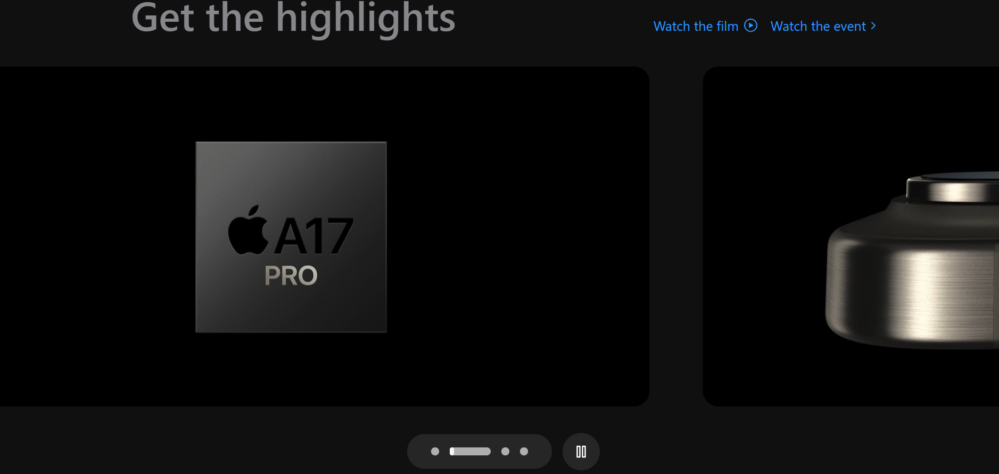
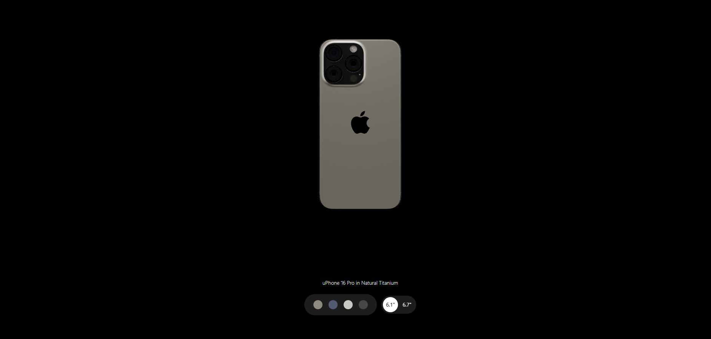

# 🍌 Banana-Uphone

Banana-Uphone is a stunning clone of Apple's iPhone 15 Pro product page, built with **React.js**, **Tailwind CSS**, **Three.js**, and **GSAP**. It delivers an immersive, interactive experience showcasing the iPhone 15 Pro in a variety of colors and shapes — all wrapped in smooth animations and modern web practices.

---

## 🤖 Introduction

This project demonstrates the powerful capabilities of modern web tech in mimicking real-world product experiences. From subtle transitions to 3D model exploration, Banana-Uphone brings Apple's design aesthetic to life using:

- **GSAP (Greensock)** for fluid animation
- **Three.js** & **React Three Fiber** for rich 3D rendering
- **Tailwind CSS** for rapid styling and responsive layouts

---

## ⚙️ Tech Stack

- **React.js**
- **Three.js**
- **React Three Fiber**
- **React Three Drei**
- **GSAP (Greensock)**
- **Vite**
- **Tailwind CSS**

---

## 🔋 Features

👉 **Beautiful Subtle Smooth Animations with GSAP**  
Enhance user experience with elegant, seamless animations.

👉 **3D iPhone Rendering (Multiple Colors & Sizes)**  
Spin, zoom, and explore the iPhone 15 Pro in different variations.

👉 **Custom GSAP-powered Video Carousel**  
A unique video carousel for engaging product presentation.

👉 **Fully Responsive Design**  
Optimized for all screen sizes, from mobile to desktop.

👉 **Modular, Scalable Codebase**  
Clean, reusable components and thoughtful architecture.

---

## 📸 Screenshots

  
   
  
  
   
  
  
  

---
